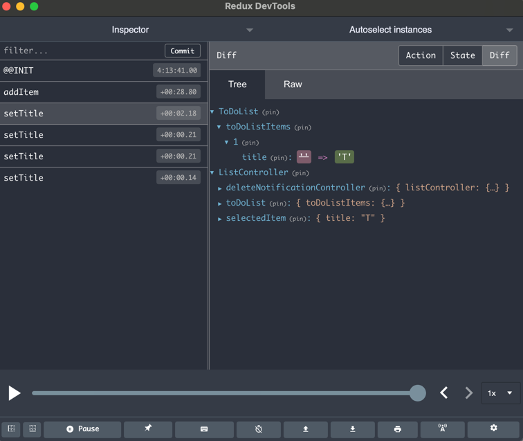
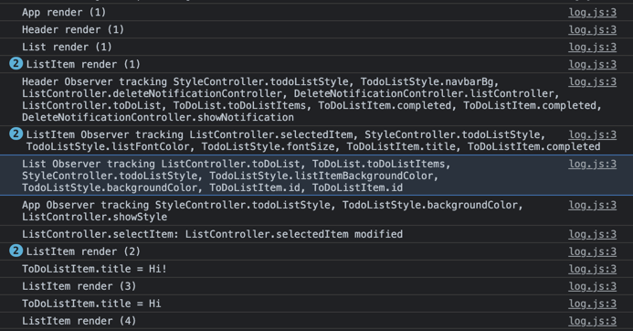

Aside from your normal Javascript debugger enhanced by react-devtools you also have two other debugging features:
* Integration with Redux-devtools which lets you monitor actions and state
* Detailed logging of state change, oberver property tracking and state mutation so you know exactly where state is changing.

## Redux DevTools ##

[Redux-DevTools](https://github.com/zalmoxisus/redux-devtools-extension) is a Chrome extension designed for Redux which monitors actions and state changes.  It also allows you to "time travel" to the state after any past action was fired.  Actions are simply the highest level member function called that mutates state.

Integration is simply including [**configureReduxDevTools**](../API/tools#configureReduxDevTools) before you make any objects observable and [**initReduxDevTools**](../API/tools#initReduxDevTools) after your state is setup:
```typescript
configureReduxDevTools();
const classes = Object.values(require('./store'));
const toDoList = persist(new ToDoList(), {key: 'root', classes});
initReduxDevTools();
```
Then you can monitor your state as actions are applied to it




> It is not recommended using Redux-DevTools in production since your application must keep copies of state objects in memory.

## Logging ##

[**setLogLevel**](../API/tools.md#setloglevel) turns on logging which does extensive reporting on how Proxily is tracking references to your state properties, which state properties are mutating and which components are rendering.



> Enabling logging in production could potentially cause sensitive data (e.g. passwords) to be exposed if they are in your state
